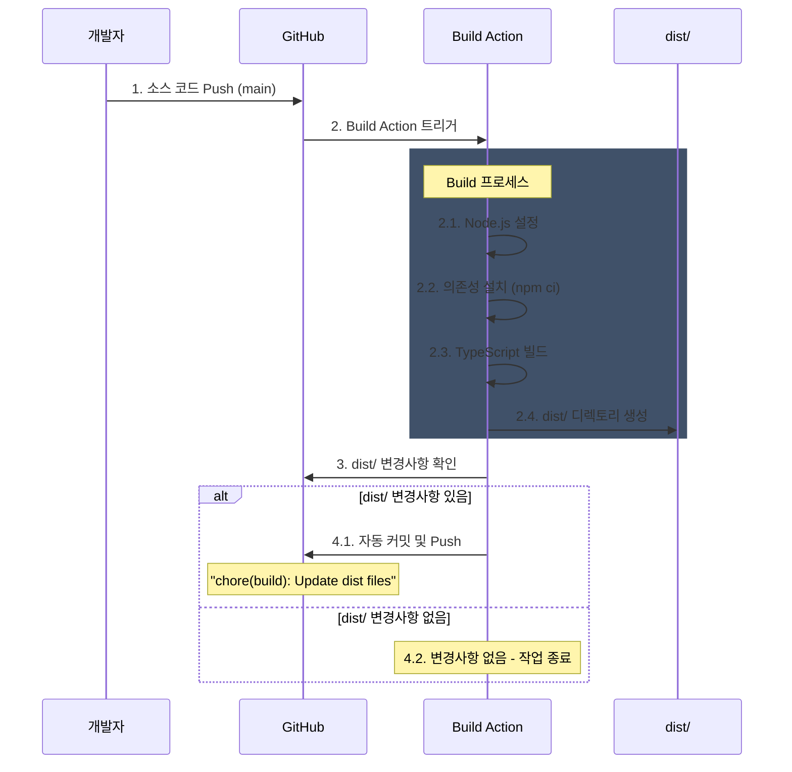
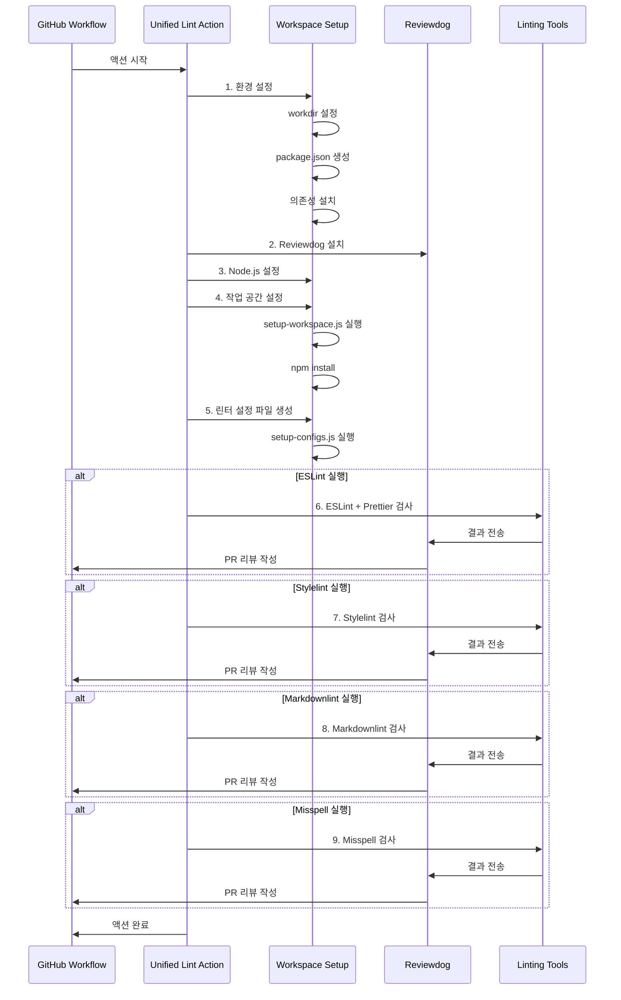
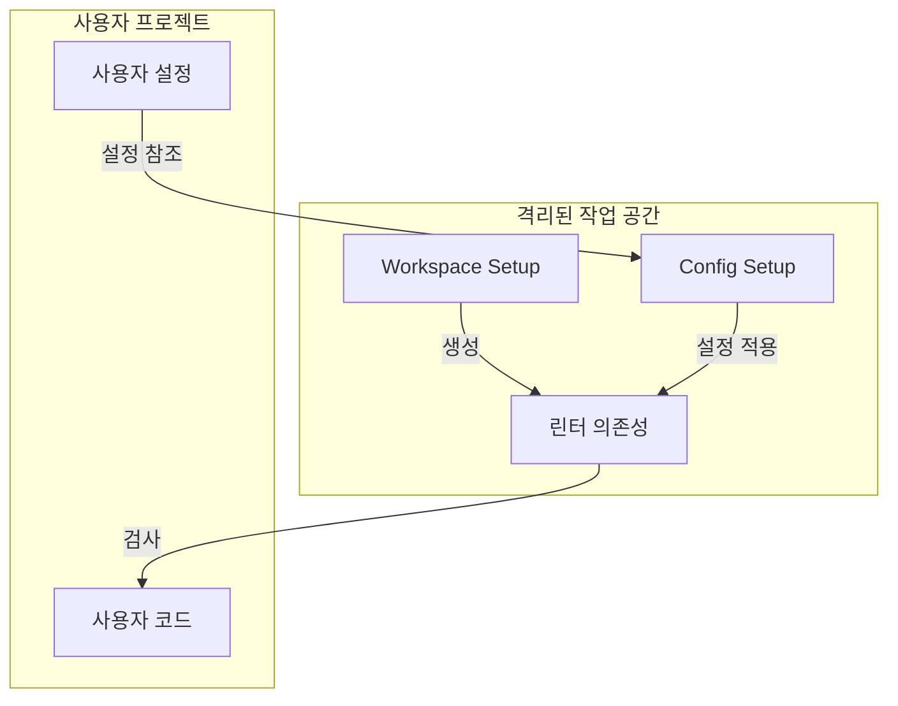

# Unified Lint Action 아키텍처

이 문서는 Unified Lint Action의 아키텍처와 작동 방식을 설명합니다.

## 1. 개발 및 빌드 프로세스

### 1.1 개발 및 배포 흐름

### 1.2 소스 코드 구조
- `src/` 디렉토리
  - `setup-workspace.ts`: 작업 공간 및 package.json 설정
  - `setup-configs.ts`: 린터 설정 파일 관리

### 1.3 빌드 자동화
- GitHub Actions (`build.yml`)에 의해 자동화된 빌드 프로세스
- main 브랜치 Push 또는 PR 이벤트 시 트리거
- 빌드 결과물은 `dist/` 디렉토리에 자동으로 커밋

### 1.4 배포 프로세스
1. TypeScript 소스 수정
2. main 브랜치에 Push
3. Build Action 자동 실행
4. dist/ 디렉토리 자동 업데이트 (필요한 경우)
5. 사용자는 배포된 dist/ 디렉토리의 JS 파일을 사용

## 2. 액션 실행 시퀀스

## 3. 주요 컴포넌트

### 3.1 Workspace Setup (`setup-workspace.ts`)
- TypeScript로 작성된 설정 스크립트
- 주요 기능:
  1. 격리된 작업 공간 생성
     - 사용자의 프로젝트와 린터 의존성 분리
     - 버전 충돌 방지
  2. `package.json` 생성 및 의존성 관리
     - 린터별 필수 의존성 자동 설치
     - 버전 정보 중앙 관리로 일관성 유지
  3. 보안 관련:
     - 의존성 버전 고정으로 supply chain 공격 방지
     - 작업 공간 격리로 사용자 프로젝트 보호
     - 최소 권한 원칙 준수

### 3.2 Config Setup (`setup-configs.ts`)
- 린터 설정 파일 관리 스크립트
- 주요 기능:
  1. 린터 설정 파일 자동 생성
     - 각 린터별 기본 설정 제공
     - 사용자 정의 설정과 병합
  2. 설정 우선순위 관리
     - 사용자 설정 > 기본 설정
     - 프로젝트 루트 설정 > 전역 설정
  3. 보안 관련:
     - 설정 파일 검증
     - 악의적인 설정 주입 방지
     - 안전한 기본값 제공

### 3.3 보안 아키텍처

1. 작업 공간 격리
   - 린터와 의존성이 사용자 프로젝트와 분리
   - 의존성 충돌 및 오염 방지

2. 의존성 관리
   - 모든 패키지 버전 명시적 지정
   - package-lock.json 사용으로 의존성 고정
   - 취약점이 있는 버전 자동 감지 및 차단

3. 설정 파일 보안
   - 사용자 설정 파일 검증
   - 안전한 기본 설정 제공
   - 설정 파일 접근 제한

4. 권한 관리
   - GitHub Token 최소 권한 사용
   - 파일 시스템 접근 제한
   - 네트워크 요청 제한

### 3.4 Reviewdog 통합
- 모든 린터의 결과를 수집
- GitHub PR에 통합된 리뷰 코멘트 작성
- 다양한 리포팅 모드 지원 (PR 리뷰, 체크 등)

### 3.5 린터 도구
1. ESLint + Prettier
   - JavaScript/TypeScript 코드 검사
   - 코드 스타일 통일
2. Stylelint
   - CSS/SCSS 파일 검사
3. Markdownlint
   - 마크다운 문서 검사
4. Misspell
   - 오타 검사

## 4. 설정 관리

### 4.1 버전 관리
- 린터 버전 정보는 `setup-workspace.ts`에서 관리
- 각 린터의 의존성 버전도 함께 관리

### 4.2 설정 파일
- 기본 설정 파일은 `configs/` 디렉토리에 저장
- 사용자 정의 설정 파일 지원
  - `eslint_config_path`
  - `stylelint_config_path`
  - `markdownlint_config_path` 